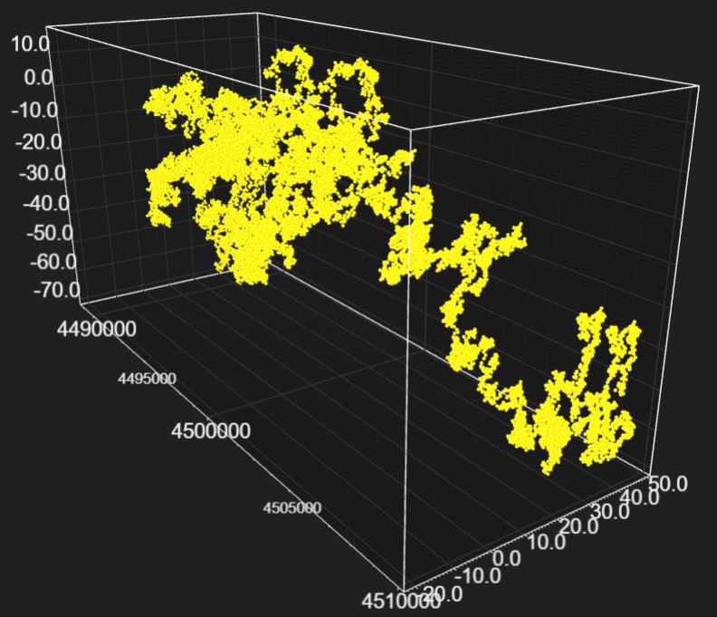
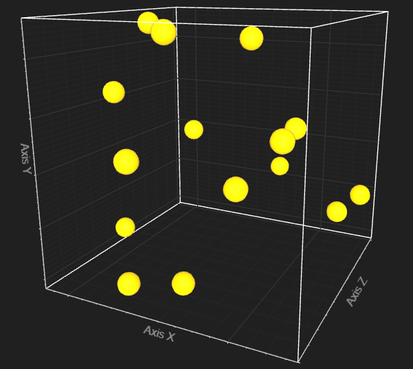
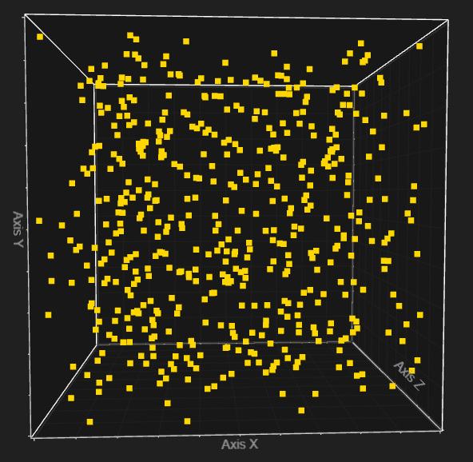
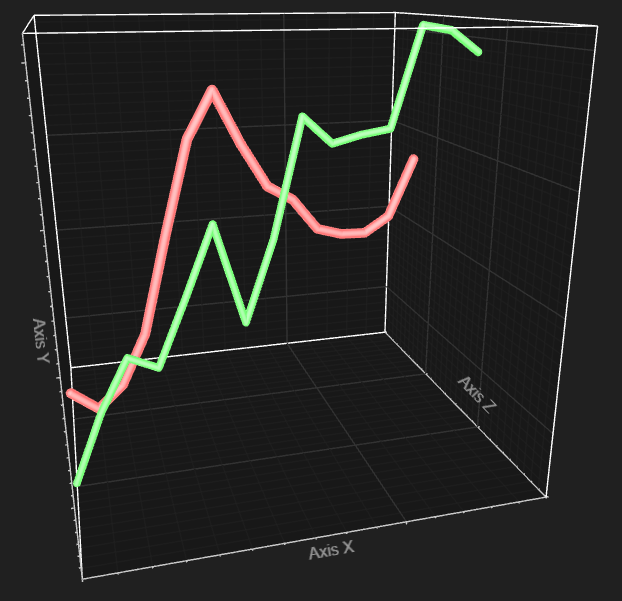

# LightningChart&#174; JS 3D Line and Point Series real-time performance showcase

This repository is a showcase for rendering a rapidly streaming 3D dataset (up to more than 100 kHz) as a set of points or connected lines.

For 2D applications and more chart examples, please refer to our full [examples set][1].

Hardware accelerated rendering with *WebGL* enables applications that require rendering of massively complex data sets, or as in this case, large data sets that are updated at extremely high speed.

Try the performance on your machine [here][2]

## Performance benchmarks

Performance in real-time application is measured as the speed at which data can be streamed (points / second, or signal frequency Hz) while keeping a stable frame rate of 60 FPS (frames per second) and a smooth user experience for interacting with the chart.

Example: Feature A can handle input data from 60 kHz stream.

All input data is rendered without exception (no downsampling).

### Measurement machines:

1)	Low end PC A (Lenovo Yoga 530):
    - CPU: Intel i7-8550U 1.80 GHz
    - GPU: Intel UHD Graphics 620
    - RAM: 8 GB
    - Display: 1920 x 1080, 60 Hz

2)	High end PC A:
    - CPU: AMD Ryzen 5 3600X 3.80 GHz
    - GPU: GeForce RTX 2070 (EVGA XC Ultra Gaming, 8GB GDDR6)
    - RAM: 16 GB DDR4 @ 3200 MHz
    - Display: 1440P 144Hz monitor.

All measurements were recorded in Google Chrome.

### Point Series 3D

Each data point (x, y, z) coordinate is rendered as a detailed sphere geometry.

-	Low end PC A: 6 000 points / second (equivalent of 6 kHz signal)
-	High end PC A: **108 000 points / second** (equivalent of 108 kHz signal)

Note, how the data rendering speed greatly benefits from having a strong GPU.

If *even faster* streaming speeds are required, then a *Point Cloud Series 3D* can be used to render the same data without 3D geometry for maximum performance:

-	Low end PC A: **65 000 points / second** (equivalent of 65 kHz signal)
-	High end PC A: **504 000 points / second** (equivalent of 504 kHz signal)

### Line Series 3D

Active set of data points (x, y, z) coordinates is rendered as a continuous high detail line geometry.

-	Low end PC A: 1 500 points / second (equivalent of 1.5 kHz signal)
-	High end PC A: **67 000 points / second** (equivalent of 67 kHz signal)

## More information 

Performance metrics have been measured with LC JS v2.2.0 January 2021.

More information about LightningChart&#174; JS can be found from our website, https://www.arction.com/lightningchart-js/.

Official [API documentation][3] can be found on [Arction][4] website.

If the docs and other materials do not solve your problem as well as implementation help is needed, ask on [StackOverflow][5] (tagged lightningchart).

If you think you found a bug in the LightningChart JavaScript library, please contact support@arction.com.

Direct developer email support can be purchased through a [Support Plan][6] or by contacting sales@arction.com.

© Arction Ltd 2009-2021. All rights reserved.

[1]: https://www.arction.com/lightningchart-js-interactive-examples/
[2]: https://arction.github.io/lcjs-point-line-series-3d/
[3]: https://www.arction.com/lightningchart-js-api-documentation
[4]: https://www.arction.com
[5]: https://stackoverflow.com/questions/tagged/lightningchart
[6]: https://www.arction.com/support-services/
